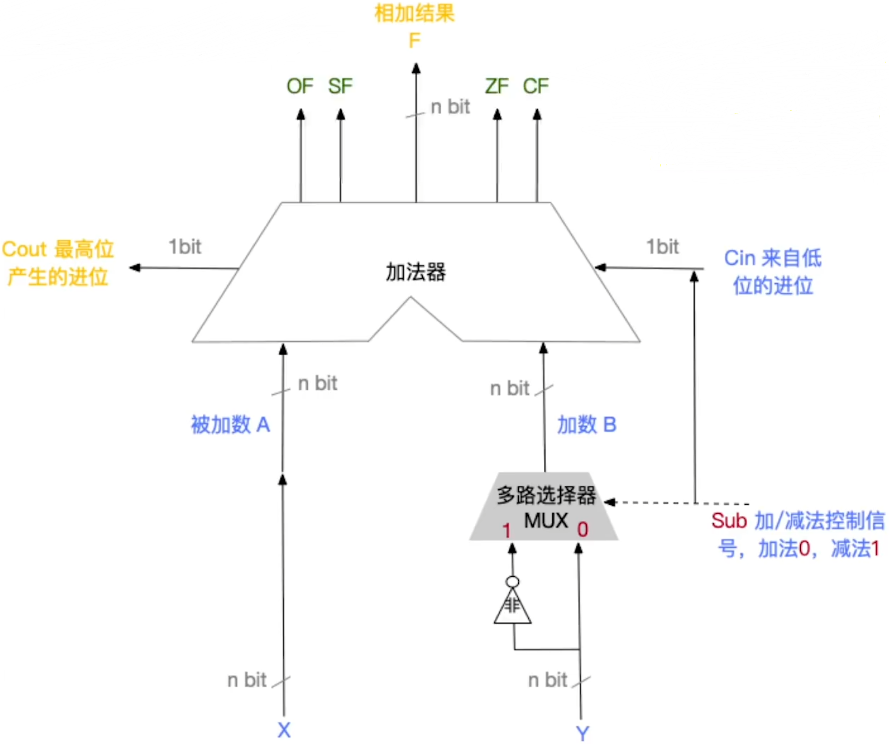
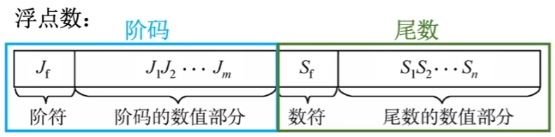
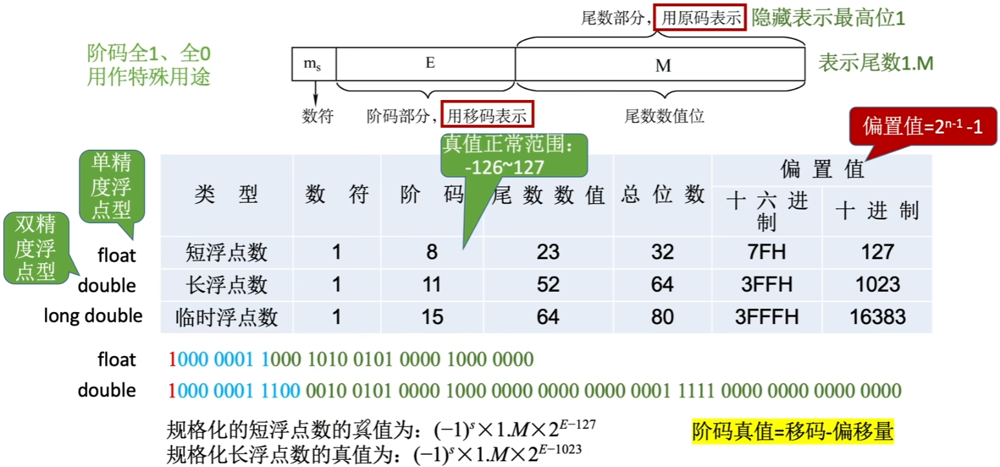

# Computer-Organization-and-Architecture

|      |                  |                                                              |
| ---- | ---------------- | ------------------------------------------------------------ |
| 1    | 计算机系统概述   | 计算机发展历程 计算机系统层次结构 计算机的性能指标 |
| 2    | 数据的表示和运算 | 数制与编码 运算方法和运算电路 浮点数的表示与运算   |
| 3    | 存储系统         | 存储器概述 主存储器 主存储器与CPU的连接 外部存储器 高速缓冲存储器 虚拟存储器 |
| 4    | 指令系统         | 指令系统 指令的寻址方式 程序的机器级代码表示 CISC和RISC的基本概念 |
| 5    | 中央处理器       | CPU的功能和基本结构 指令执行过程 数据通路的功能和基本结构 控制器的功能和工作原理 异常和中断机制 指令流水线 多处理机的基本概念 |
| 6    | 总线             | 总线概述 总线事务和定时                                 |
| 7    | 输入/输出系统    | I/O系统基本概念 I/O接口 I/O方式                    |

# 运算

## 运算器

| 组成                                       |
| ------------------------------------------ |
| 算术逻辑单元（Arithmetic Logic Unit, ALU） |
| 移位器                                     |
| 状态寄存器（PSW）                          |
| 通用寄存器组                               |

| 功能     |                              |
| -------- | ---------------------------- |
| 四则运算 | 加 减 乘 除   |
| 逻辑运算 | 与 或 非 异或 |
| 移位运算 | 左移 右移               |
| 求补     | \                            |

## 算术逻辑单元

ALU是一种功能较强的组合逻辑电路，它能进行多种算术运算和逻辑运算。由于加、减、乘、除运算最终都能归结为加法运算，因此ALU的核心是带标志加法器，同时也能执行“与”“或”“非”等逻辑运算。

| 核心         |
| ------------ |
| 带标志加法器 |

## 移位运算

当计算机中没有乘/除法运算电路时，可以通过加法和移位相结合的方法实现乘/除法运算。

|          | 左移                  | 右移                       | 溢出判断                          | 精度丢失                          |
| -------- | --------------------- | -------------------------- | --------------------------------- | --------------------------------- |
| 逻辑移位 | 高位移出 低位补0 | 低位移出 高位补0      | 左移时，若高位的1移出，则发生溢出 | \                                 |
| 算术移位 | 高位移出 低位补0 | 低位移出 高位补符号位 | 左移前后的符号位不同，则发生溢出  | 右移时，若低位的1移出，则丢失精度 |

## 加减运算

$$
\begin{align}
[A+B]&=[A]_补+[B]_补\mod2^{n+1}\\
[A-B]&=[A]_补+[-B]_补\mod2^{n+1}
\end{align}
$$

1. 符号位与数值为一起参与运算，运算结果的符号位也在运算中直接得出。
2. 运算结果保留n+1位，运算结果亦为补码。

$$
\begin{align}
B&=+24\\
[B]_补&=0001\ 1000\\
[-B]_补&=1110\ 1000
\end{align}
$$

### 溢出判断

仅当两个符号相同的数相加才可能溢出。

1. 一位符号位 模2补码
   $$
   V=A_sB_s\overline{S_s}+\overline{A_s}\overline{B_s}S_s
   $$

2. 双符号位 模4补码

   存储时只存储一个符号位，运算时会复制一个符号位
   $$
   V=S_{s1}\bigoplus S_{s2}
   $$

3. 一位符号位+数值位进位
   $$
   V=C_{n+1}\bigoplus C_{n}
   $$
   
4. 

### 运算电路

$$
\begin{align}
OverFlag&=C_{n+1}\bigoplus C_n\\
SignFlag&=F_n\\
ZeroFlag&=F==0\\
CarryFlag&=Cout\bigoplus{Cin}
\end{align}
$$

## 原码乘法

原码乘法的特点是符号位与数值位是分开求的。

1. 乘积的符号位由两个乘数的符号位“异或”得到；
2. 乘积的数值位是两个乘数的绝对值之积。

# 浮点数

## 表示

- 尾数给出一个小数，阶码指明了小数点要向前/向后移动几位。
- 价码：常用补码或移码表示的整数
- 尾数：常用原码或补码表示的小数
- 阶码E反映浮点数的表示范围及小数点的实际位置
- 尾数M的数值部分的位数n反映浮点数的精度

## 规格化

规格化浮点数：规定尾数的最高数值位必须是一个有效值。

## IEEE 754

注意：移码只能用于表示整数

移码=真值+偏置值

## 加减运算

## C语言中的浮点数类型

## 数据的大小端和对齐存储
